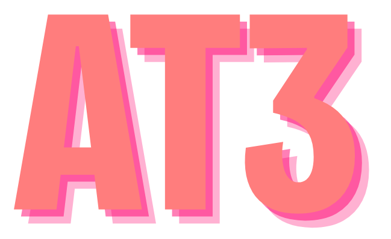

# The AT3 Stack

**AIT3E** (/eɪ aɪ tiː θriː iː/ AY-eye-TEE-three-EE, /eɪt θriː iː/ AYT-three-EE, **AT3** for short, **83** as shorthand) is the AI-native evolution of the T3 stack, built for edge deployment and serverless infrastructure.

## What's in the name?

**AIT3E** (/eɪ aɪ tiː θriː iː/ AY-eye-TEE-three-EE, /eɪt θriː iː/ AYT-three-EE) carries both technical and personal significance:

- **AI** - First-class artificial intelligence integration
- **T3** - The beloved Next.js + TypeScript + Tailwind foundation  
- **E** - Edge computing and serverless deployment
- **83** - The second half of 1983, representing personal connection to this evolution

The "83" isn't just a number—it's the second half of my birth year (1983), making this stack deeply personal. Just as 1983 represented a pivotal year in computing history, AIT3E represents the pivotal evolution from traditional web development to AI-native applications.

**AT3** for short, or simply **83** as shorthand, this isn't just another tech stack—it's a philosophy of building for the AI era while staying grounded in proven patterns.

## The Stack Architecture

### **Frontend Layer**
- **Next.js** with App Router & React Server Components
- **React 19+** with Suspense for AI streaming  
- **TypeScript** everywhere with strict type safety
- **Tailwind CSS** + **Radix UI** components

### **Backend Layer**  
- **Supabase** (PostgreSQL + Auth + Real-time + Vector extensions)
- **Vercel Edge Functions** (or Cloudflare Workers)
- **Serverless** architecture with zero server management

### **AI Layer**
- **Vercel AI SDK** for streaming responses
- **Multi-provider support** (OpenAI, Anthropic, Google AI)
- **Vector databases** for embeddings & RAG
- **Real-time streaming** with React Suspense

### **Infrastructure Layer**
- **Edge-first deployment** (Vercel/Cloudflare)
- **Global CDN** distribution  
- **Automatic scaling** based on demand
- **Zero configuration** deployment

## Why AIT3E?

Traditional T3 is great for web apps; AIT3E is perfect for AI-powered applications that need to stream responses in real-time, scale automatically, handle global users with low latency, and maintain type safety across the entire stack without managing infrastructure. 

It combines the beloved Next.js + TypeScript + Tailwind foundation with first-class AI integration (Vercel AI SDK, multiple providers like OpenAI/Anthropic), serverless backend services (Supabase for database/auth, Vercel Edge Functions), and edge-first deployment for global performance.

It's ideal for AI assistants, document processing platforms, content generation tools, and SaaS products with AI features, but overkill for simple static sites or apps requiring full infrastructure control.

## Perfect for

- **AI assistants and chatbots** - Stream responses with low latency
- **Document processing platforms** - Handle files with AI analysis  
- **Content generation tools** - Real-time text, image, code generation
- **Real-time collaboration apps** - Multi-user experiences with AI
- **Data analysis dashboards** - AI-powered insights and visualization
- **SaaS products with AI features** - Embed AI into existing workflows

## Consider alternatives for

- **Simple static sites** - Traditional static generators may be simpler
- **Apps needing custom infrastructure** - Raw cloud providers offer more control

## Key Advantages

1. **AI-Native**: Built for streaming AI responses, not retrofitted
2. **Edge-First**: Global latency < 100ms anywhere in the world  
3. **Type-Safe AI**: End-to-end TypeScript including AI interactions
4. **Serverless**: Zero server management, infinite scaling
5. **Real-Time**: Built-in streaming, WebSockets, and live updates
6. **Multi-Provider**: Avoid AI vendor lock-in with unified API

## Getting Started with AIT3E

1. **Start with proven patterns** - T3 foundation you already know
2. **Add AI capabilities** - Vercel AI SDK and provider integrations
3. **Configure backend services** - Supabase for data and auth
4. **Deploy to edge** - Vercel/Cloudflare for global performance
5. **Scale automatically** - Zero infrastructure management

The beauty of AIT3E is that you're building on proven patterns (T3) while adding modern capabilities (AI + Edge) that work together seamlessly.

---

*AIT3E represents the natural evolution of full-stack development for the AI era - combining the reliability of established patterns with the power of modern AI and edge computing.*