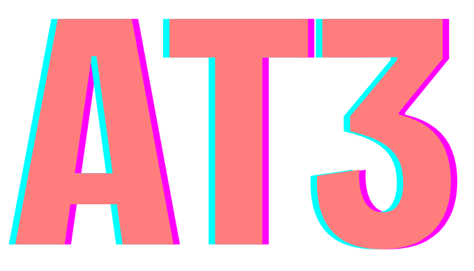

# AT3 Stack Kit

<div align="center">



**Upgrade existing projects to AT3 Stack with intelligent migration**

[](https://badge.fury.io/js/@entro314-labs%2Fat3-stack-kit)
[](https://opensource.org/licenses/MIT)
[](https://nodejs.org/)

</div>

**AT3 Stack Kit** intelligently upgrades your existing Next.js, React, or T3 projects to the full AT3 Stack (AIT3E) with AI integration, edge deployment capabilities, and modern development tools.

## About AT3 Stack

**AT3** (AIT3E) combines the proven T3 foundation with first-class AI integration and edge-first architecture:

- **🤖 AI** - First-class artificial intelligence integration with multiple providers
- **📚 T3** - The beloved Next.js + TypeScript + Tailwind foundation  
- **⚡ E** - Edge computing and serverless deployment

## Quick Start

```bash
# Upgrade your current project to AT3 Stack
npx @entro314-labs/at3-stack-kit

# Or with pnpm (recommended)
pnpm dlx @entro314-labs/at3-stack-kit

# Or install globally
npm install -g @entro314-labs/at3-stack-kit
at3-kit
```

## Features

### **🔍 Smart Project Detection**
Automatically analyzes your existing project structure and dependencies to determine the best upgrade path.

### **🤖 AI Integration**
Add AI capabilities to your existing project:
- **Custom AI** - Flexible integration with OpenAI, Anthropic, Google AI
- **Vercel AI SDK** - Streamlined AI with built-in streaming support
- **Hybrid Approach** - Combine multiple AI providers for maximum flexibility

### **⚡ Edge Enhancement**
Transform your app for edge deployment:
- Supabase integration for edge-compatible database
- Middleware optimization for edge runtime
- Global CDN and serverless deployment ready

### **📦 Modern Development Stack**
Upgrade your development experience:
- PWA support for mobile-first experiences
- Internationalization (i18n) for global apps
- Comprehensive testing setup with Vitest and Playwright
- Modern build tools and optimizations

### **🛡️ Safe Migration**
- **Backup Creation** - Automatic backups before any changes
- **Rollback Support** - Easy revert if needed
- **Dry Run Mode** - Preview changes without applying them
- **Incremental Updates** - Add features one at a time

## Usage

### Interactive Mode (Recommended)

```bash
# Launch interactive upgrade wizard
npx @entro314-labs/at3-stack-kit
```

The CLI will:
1. 🔍 Analyze your current project
2. 💡 Recommend AT3 features based on your stack
3. ✨ Guide you through feature selection
4. 🚀 Apply changes with progress tracking

### Command Line Options

```bash
# Upgrade specific directory
at3-kit /path/to/project

# Add specific feature
at3-kit --add ai-vercel

# Preview changes without applying
at3-kit --dry-run

# Skip interactive prompts
at3-kit --yes

# Verbose logging
at3-kit --verbose
```

### Available Features

| Feature | Description | Best For |
|---------|-------------|----------|
| `ai-custom` | Custom AI integration with multiple providers | Maximum flexibility |
| `ai-vercel` | Vercel AI SDK integration | Rapid AI development |
| `supabase` | Database, auth, and edge functions | Full-stack applications |
| `pwa` | Progressive Web App features | Mobile-first experiences |
| `i18n` | Internationalization support | Global applications |
| `testing` | Comprehensive testing setup | Production applications |

## Project Analysis

Get detailed insights about your project:

```bash
# Analyze current project compatibility
at3-kit analyze

# Check what AT3 features are missing
at3-kit detect
```

Sample output:
```
📊 Project Analysis
Type: Next.js application
Package Manager: pnpm
Features: TypeScript, Tailwind CSS, tRPC

🔍 AT3 Compatibility: ✅ Ready for upgrade
💡 Recommended: AI integration, Supabase, Testing setup
⚡ Missing: Edge optimization, PWA features
```

## Migration Examples

### Upgrading a T3 App

```bash
# Your T3 app structure
your-t3-app/
├── src/
│   ├── pages/
│   ├── server/
│   └── styles/
└── package.json

# After AT3 upgrade
your-t3-app/
├── src/
│   ├── app/              # ✨ Migrated to App Router
│   ├── components/ai/    # 🤖 AI components
│   ├── lib/supabase/     # ⚡ Edge database
│   ├── server/
│   └── styles/
├── middleware.ts         # ⚡ Edge middleware  
└── .at3-config.json     # 📝 AT3 configuration
```

### Upgrading a React App

```bash
# Before: Create React App
react-app/
├── src/
├── public/
└── package.json

# After: AT3 Stack
react-app/
├── src/
│   ├── app/              # ✨ Next.js App Router
│   ├── components/       # 🔄 Migrated components
│   ├── lib/ai/           # 🤖 AI integration
│   └── styles/           # 🎨 Tailwind CSS
├── next.config.js        # ⚙️ Next.js configuration
└── tailwind.config.js    # 🎨 Styling configuration
```

## Configuration

AT3 Stack Kit creates an `.at3-config.json` file to track your project's AT3 integration:

```json
{
  "version": "0.1.0",
  "created": "2024-01-09T...",
  "features": ["ai-vercel", "supabase", "testing"],
  "toolsUsed": ["at3-stack-kit"],
  "lastMigration": "2024-01-09T..."
}
```

This enables:
- 🔄 Smart integration with other AT3 tools
- 📊 Progress tracking across upgrades
- 💡 Contextual recommendations
- 🚀 Workflow continuity

## AT3 Ecosystem

**AT3 Stack Kit** works seamlessly with other AT3 tools:

- **[create-at3-app](../create-at3-app)** - Start new projects with AT3 Stack
- **[@entro314-labs/at3-toolkit](../at3-toolkit)** - Advanced development tools and migration

## Supported Projects

AT3 Stack Kit can upgrade:

- ✅ **Next.js** applications (Pages or App Router)
- ✅ **React** applications (Create React App, Vite, custom)
- ✅ **T3 Stack** applications
- ✅ **TypeScript** and **JavaScript** projects
- ✅ **Monorepo** projects (with proper configuration)

## Requirements

- Node.js 18.0.0 or higher
- One of: npm, pnpm, yarn, bun
- Git (for backup creation)

## Advanced Usage

### Rollback Changes

```bash
# Rollback last migration
at3-kit rollback

# Rollback to specific backup
at3-kit rollback --backup 2024-01-09-backup
```

### Custom Configuration

```bash
# Use custom templates
at3-kit --template-dir ./custom-templates

# Skip specific checks
at3-kit --skip-checks typescript,eslint

# Apply migrations in stages
at3-kit --stage database
at3-kit --stage ai
at3-kit --stage testing
```

## Troubleshooting

### Common Issues

**Migration fails with dependency conflicts:**
```bash
# Clean install and retry
rm -rf node_modules package-lock.json
at3-kit --force
```

**TypeScript errors after upgrade:**
```bash
# Update TypeScript configuration
at3-kit --fix-typescript
```

**Supabase setup fails:**
```bash
# Manual Supabase initialization
npx supabase init
at3-kit --skip-supabase
```

## Contributing

We welcome contributions! Please see our [Contributing Guide](../../CONTRIBUTING.md).

## Support

- 📖 [Documentation](https://at3-stack.dev)
- 🐛 [Issues](https://github.com/entro314-labs/at3-stack-kit/issues)
- 💬 [Discord](https://discord.gg/at3-stack)
- 🐦 [Twitter](https://twitter.com/at3stack)

## License

MIT © [entro314-labs](https://github.com/entro314-labs)