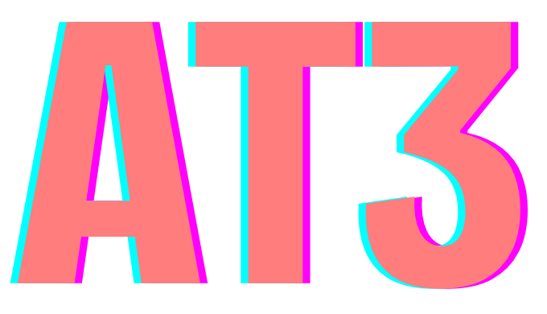

# AT3 Toolkit

<div align="center">



**Advanced development toolkit for AT3 Stack projects**

[](https://badge.fury.io/js/@entro314-labs%2Fat3-toolkit)
[](https://opensource.org/licenses/MIT)
[](https://nodejs.org/)

</div>

**@entro314-labs/at3-toolkit** is the advanced development toolkit for AT3 Stack projects. It provides intelligent project migration, sophisticated linting configurations, comprehensive testing setups, and development workflow optimization for AI-native applications.

## About AT3 Stack

**AT3** (AIT3E) combines the proven T3 foundation with first-class AI integration and edge-first architecture:

- **🤖 AI** - First-class artificial intelligence integration with multiple providers
- **📚 T3** - The beloved Next.js + TypeScript + Tailwind foundation  
- **⚡ E** - Edge computing and serverless deployment

## Features

### **🛠️ Development Toolkit**
Comprehensive tools for AT3 Stack development:
- **Advanced Linting** - ESLint, Prettier, and Biome configurations optimized for AT3
- **Testing Setup** - Vitest, Playwright, and custom test configurations
- **Code Quality** - TypeScript strict mode, import sorting, and code formatting
- **Performance Analysis** - Bundle analysis and optimization recommendations

### **🔄 Project Migration**
Intelligent migration capabilities:
- **Framework Detection** - Automatically detects Next.js, React, Vue, Nuxt, and other project types
- **Configuration Updates** - Migrates to AT3 standards (Tailwind 4.x, Biome, AI integrations)
- **Dependency Management** - Handles package updates and conflict resolution
- **Safe Migrations** - Creates backups with rollback capability

### **⚙️ Advanced Configuration**
Sophisticated project setup:
- **Multi-Framework Support** - Works with Next.js, React, Vue, Nuxt, and Node.js projects
- **Package Manager Detection** - Intelligent support for pnpm, npm, yarn, and bun
- **Environment Configuration** - Automated .env setup and validation
- **Monorepo Support** - Advanced configurations for complex project structures

### **🎯 Developer Experience**
- **Interactive CLI** - Modern terminal interface with beautiful prompts
- **Dry Run Mode** - Preview changes without applying them
- **Verbose Logging** - Detailed output for debugging and understanding changes
- **Smart Suggestions** - Context-aware recommendations for project improvements

## Installation

### Using npx (Recommended)
```bash
# Quick migration to AT3 stack
npx @entro314-labs/at3-toolkit

# Advanced project analysis
npx @entro314-labs/at3-toolkit detect

# Interactive migration wizard
npx @entro314-labs/at3-toolkit migrate --interactive
```

### Global Installation
```bash
npm install -g @entro314-labs/at3-toolkit
at3-toolkit
```

### Local Installation
```bash
npm install --save-dev @entro314-labs/at3-toolkit
npx at3-toolkit
```

## Usage

### CLI Usage

#### Basic AIT3E Migration
```bash
# Migrate current directory to AIT3E stack
npx @entro314-labs/at3-toolkit

# Migrate specific project
npx @entro314-labs/at3-toolkit /path/to/project

# Interactive mode with AIT3E migration plan
npx @entro314-labs/at3-toolkit --interactive

# Preview AIT3E changes without applying
npx @entro314-labs/at3-toolkit --dry-run
```

#### Advanced Options
```bash
# Replace ESLint/Prettier with Biome + add AI linting rules
npx @entro314-labs/at3-toolkit --replace-linting

# Update to AIT3E stack dependency versions
npx @entro314-labs/at3-toolkit --update-versions

# Skip dependency installation (manual control)
npx @entro314-labs/at3-toolkit --no-deps

# Verbose logging for debugging
npx @entro314-labs/at3-toolkit --verbose

# Force migration without confirmations
npx @entro314-labs/at3-toolkit --force
```

#### AIT3E-Specific Commands
```bash
# Analyze project for AIT3E compatibility
npx @entro314-labs/at3-toolkit detect

# Initialize new AIT3E project
npx @entro314-labs/at3-toolkit init my-ai-app --template ait3e

# Rollback AIT3E migration
npx @entro314-labs/at3-toolkit rollback
```

### Programmatic Usage

```typescript
import { migrateProject, detectProject } from '@entro314-labs/at3-toolkit';

// Migrate a project to AIT3E stack
const result = await migrateProject('/path/to/project', {
  updateVersions: true,
  replaceLinting: true,
  dryRun: false
});

// Analyze AIT3E compatibility
const projectInfo = await detectProject('/path/to/project');
console.log(`Detected: ${projectInfo.type} project (AIT3E compatible: ${projectInfo.hasAISupport})`);
```

## What AT3 Toolkit Migrates to AIT3E

### AIT3E Stack Components

#### Frontend Layer
- **Next.js 15.4.6** with App Router and Turbopack
- **React 19.1.1** with Suspense for AI streaming
- **TypeScript 5.9.2** with strict configuration
- **Tailwind CSS 4.1.11** + Shadcn/ui components

#### Backend Layer  
- **Supabase** (PostgreSQL + Auth + Real-time + Vector extensions)
- **Vercel Edge Functions** (serverless compute)
- **Row Level Security** with comprehensive policies
- **Database migrations** and type generation

#### AI Layer
- **Multi-provider AI client** (OpenAI, Anthropic, Google AI)
- **Vercel AI SDK** patterns for streaming responses
- **React hooks** for AI completions and chat
- **Rate limiting** and error handling
- **Vector database** support for embeddings

#### Infrastructure Layer
- **Edge-first deployment** (Vercel/Cloudflare ready)
- **Global CDN** distribution
- **Automatic scaling** based on demand
- **Zero server management**

### Configuration Migrations

#### Core Configurations
- **Tailwind CSS 3.x → 4.1.11** - CSS-first configuration, AI-optimized components
- **ESLint + Prettier → Biome 2.1.4** - Unified linting with AI-aware rules
- **Next.js Config** - AIT3E optimizations, edge runtime, AI streaming
- **TypeScript** - Latest TS 5.9.2 with AI type definitions
- **Testing** - Jest → Vitest migration with AI component testing

#### AI-Specific Additions
- **AI Provider Configurations** - OpenAI, Anthropic, Google AI setup
- **Vector Database Setup** - Supabase vector extensions
- **Edge Runtime Config** - Optimized for AI workloads
- **Streaming Components** - React Suspense for AI responses
- **Rate Limiting** - AI request throttling and queue management

#### Dependencies Added
```json
{
  "dependencies": {
    "@ai-sdk/openai": "^0.0.66",
    "@ai-sdk/anthropic": "^0.0.50", 
    "@ai-sdk/google": "^0.0.48",
    "ai": "^3.4.32",
    "@supabase/ssr": "^0.7.0",
    "@supabase/supabase-js": "^2.54.0",
    "next": "15.4.6",
    "react": "19.1.1",
    "tailwindcss": "^4.1.11"
  }
}
```

## Examples

### Next.js to AIT3E Migration
```bash
cd my-nextjs-app
npx @entro314-labs/at3-toolkit --interactive --replace-linting --update-versions
```

This will:
1. 🔍 Detect Next.js project structure
2. 📋 Show AIT3E migration plan
3. 💾 Create backup in `.migration-backup/`
4. 🤖 Add AI SDK and provider configurations
5. 🔧 Update Next.js config for edge deployment
6. 🎨 Migrate Tailwind CSS to 4.1.11
7. 🗄️ Setup Supabase with vector extensions
8. 🔨 Replace ESLint/Prettier with Biome + AI rules
9. 📦 Update all dependencies to AIT3E versions
10. ✅ Validate AIT3E migration

### React Project to AIT3E
```bash
npx @entro314-labs/at3-toolkit /path/to/react-app --dry-run
```

Preview AIT3E conversion for a React project without applying changes.

### New AIT3E Project
```bash
npx @entro314-labs/at3-toolkit init my-ai-project --template ait3e
```

Creates a new project with full AIT3E stack configuration.

## AIT3E Migration Process

1. **Analysis** - Detects project type and AIT3E compatibility
2. **AI Planning** - Creates migration plan with AI integration strategy
3. **Backup** - Safely backs up all configuration files
4. **Core Migration** - Applies T3 updates (Next.js, TypeScript, Tailwind)
5. **AI Integration** - Adds AI SDK, providers, and streaming components
6. **Edge Configuration** - Configures for edge deployment and serverless
7. **Dependencies** - Updates packages and resolves AI/edge conflicts
8. **Validation** - Ensures AIT3E migration completed successfully

## AIT3E Templates

The tool includes AIT3E-optimized templates for:

- **Next.js 15.4.6** - Edge runtime, AI streaming, Turbopack
- **Tailwind CSS 4.1.11** - AI component variants, dark mode
- **AI SDK Integration** - Multi-provider setup, streaming hooks
- **Supabase + Vectors** - Database + embeddings + real-time
- **Biome 2.1.4** - AI-aware linting rules and formatting
- **Edge Functions** - Serverless AI endpoints
- **TypeScript 5.9.2** - AI types and edge runtime types

## AIT3E Stack Benefits

### Performance
- ⚡ **5x faster** Tailwind builds with v4
- 🚀 **Edge-first** deployment for global low latency
- 📦 **Automatic scaling** based on AI workload demand
- 🔄 **Streaming responses** for better UX

### Developer Experience
- 🤖 **Type-safe AI** interactions with full TypeScript support
- 🛠️ **Unified tooling** with Biome replacing ESLint + Prettier
- 🧪 **AI component testing** with specialized test utilities
- 📊 **Real-time monitoring** of AI usage and performance

### Production Ready
- 🔒 **Built-in security** with Supabase RLS and edge validation
- 💰 **Cost optimization** with edge caching and request batching
- 📈 **Scalable architecture** designed for AI workloads
- 🌍 **Global deployment** with CDN and edge computing

## Requirements

- **Node.js** 22.12.0 or higher
- **Package Manager** - pnpm (recommended), npm, yarn, or bun
- **AI Provider Keys** - OpenAI, Anthropic, or Google AI (optional)
- **Supabase Account** - For database and vector storage
- **Git** (recommended for version control)

## Supported Projects

### Direct AIT3E Migration
- ✅ **Next.js** - App Router, Pages Router, TypeScript
- ✅ **T3 Stack** - Direct upgrade path to AIT3E
- ✅ **React + Vite** - Migration to Next.js AIT3E
- ✅ **TypeScript Projects** - AI type integration

### Compatibility Mode
- 🔄 **Vue** - Partial migration with AI utilities
- 🔄 **Node.js APIs** - Edge function conversion
- 🔄 **Monorepos** - Workspace-aware migration

## Troubleshooting

### Common AIT3E Issues

**AI SDK installation fails**
```bash
# Try with force flag and manual installation
npx @entro314-labs/at3-toolkit --no-deps
npm install ai @ai-sdk/openai @ai-sdk/anthropic
```

**Supabase vector extensions not working**
```bash
# Check Supabase project has vector extensions enabled
# Run migration again with verbose logging
npx @entro314-labs/at3-toolkit --verbose
```

**Edge runtime compilation errors**
```bash
# Ensure all dependencies are edge-compatible
npx @entro314-labs/at3-toolkit detect --verbose
```

### Rollback
If AIT3E migration has issues:
```bash
npx @entro314-labs/at3-toolkit rollback
```

## Contributing

We welcome contributions to improve AIT3E stack migration! Please see our [Contributing Guide](CONTRIBUTING.md).

## License

MIT License - see [LICENSE](LICENSE) for details.

## Support

- 🐛 **Issues** - [GitHub Issues](https://github.com/entro314-labs/at3-stack-kit/issues)
- 📖 **AT3 Documentation** - [AT3 Stack Guide](https://at3-stack.dev)
- 💬 **Discussions** - [GitHub Discussions](https://github.com/entro314-labs/at3-stack-kit/discussions)
- 🤖 **AI Integration Help** - [AI SDK Documentation](https://sdk.vercel.ai/)

## Related Projects

- 🚀 **[create-at3-app](../create-at3-app)** - Create new AT3 Stack projects
- 📦 **[at3-stack-kit](../at3-stack-kit)** - Upgrade existing projects to AT3 Stack

---

**Made with ❤️ by the entro314-labs Team**

*Bringing AI-native development to the modern web*

**AT3 Toolkit**: The bridge between traditional web apps and the AI-powered future.